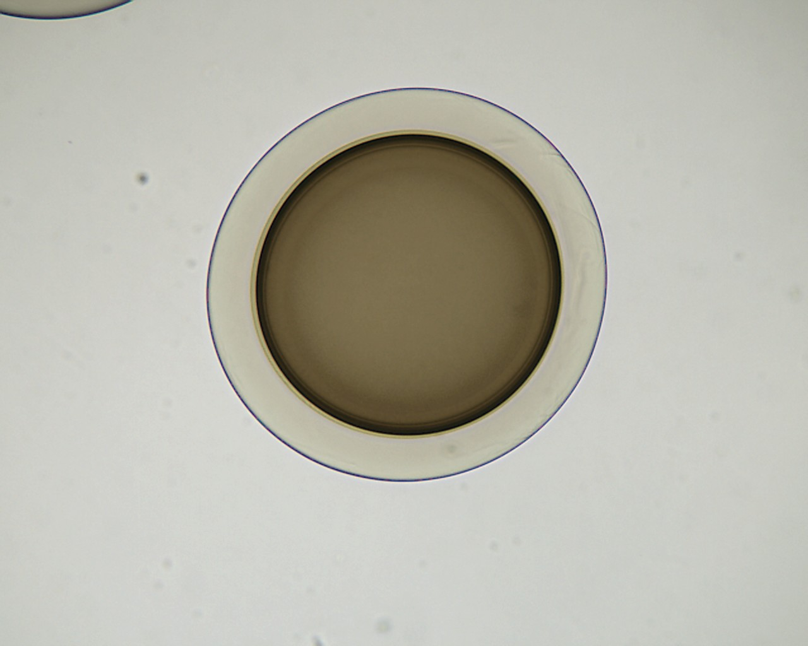
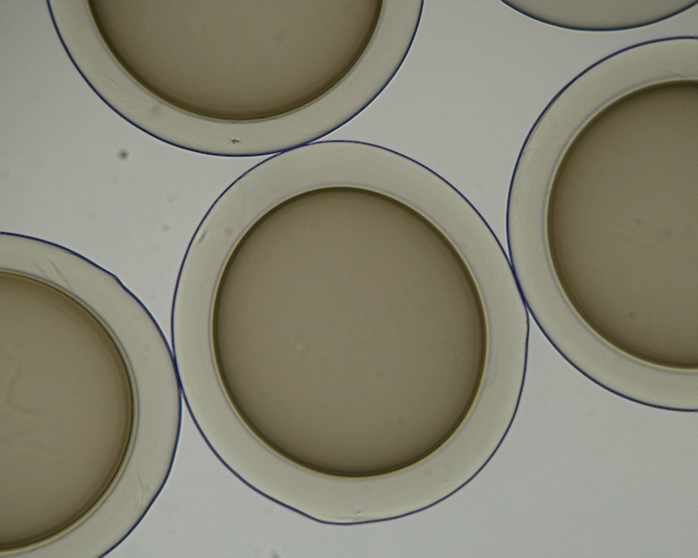

# diabetes
Cell detection in OpenCV

We introduce cell detection based on classic computer vision. 
We employ the Retinex filter (the best filter ever). 
We overcome adjacent cells with connecting curves of similar curvature by the Warshall algorithm.
 

 input image (single cell)               | output image
:-------------------------:|:-------------------------:
  |

 input image (multiple cells)              | output image
:-------------------------:|:-------------------------:
  |

